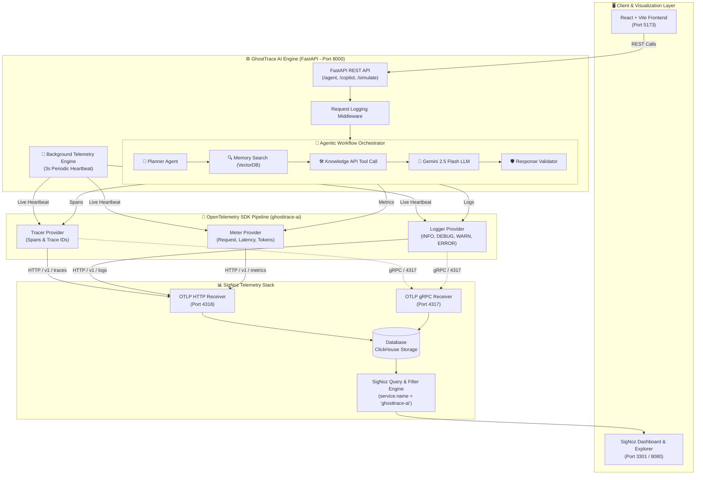
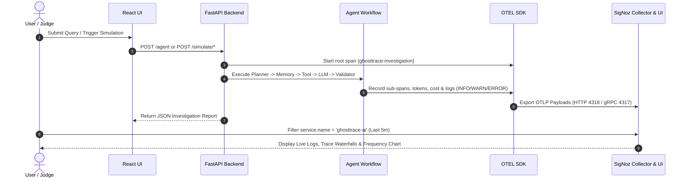

# GhostTrace AI — System Architecture & Telemetry Pipeline

GhostTrace AI is an AI Investigation & Observability Engine powered by OpenTelemetry (OTLP) and SigNoz. It provides automated root cause analysis, trace correlation, and agentic workflow monitoring.

---

## 🏗️ High-Level System Architecture

---

## 🧩 Component Breakdown

### 1. **Client & Presentation Layer**
- **GhostTrace React Dashboard**: Interactive UI for running AI investigations, comparing cases, viewing execution timelines, and launching copilot sessions.
- **SigNoz Explorer**: Real-time observability dashboard for searching logs (`service.name in ['ghosttrace-ai']`), inspecting span waterfalls, and monitoring frequency charts.

### 2. **GhostTrace AI Core Engine (`ghosttrace-ai`)**
- **FastAPI Framework**: High-performance REST endpoints handling agent requests, simulation scenarios (`healthy`, `slow_api`, `vector_failure`, `token_spike`, `hallucination`), and executive reporting.
- **Agentic Workflow Pipeline**:
  - **Planner**: Generates investigation plan and initializes trace context (`ghosttrace.case_id`, `ghosttrace.session_id`).
  - **Memory Search**: Simulates vector document retrieval and logs document counts.
  - **Knowledge API**: Simulates tool calls, measuring latency and error states.
  - **Gemini LLM**: Calculates prompt/response token usage, model inference time, and cost in USD.
  - **Response Validator**: Scores output confidence percentage, assigns severity (`Low`, `Medium`, `High`, `Critical`), and validates safety.
- **Live Telemetry Engine**: Asynchronous background ticker emitting telemetry every 3 seconds to guarantee SigNoz time-window queries (`5m`, `15m`) remain active.

### 3. **OpenTelemetry (OTLP) Telemetry Pipeline**
- **Service Name**: `ghosttrace-ai`
- **Environment**: `development`
- **Exporters**: Dual OTLP Exporters over HTTP (`http://127.0.0.1:4318`) & gRPC (`http://127.0.0.1:4317`).
- **Log Severity Normalization**: Automatic mapping of standard Python logging levels to SigNoz UI filters (`INFO`, `DEBUG`, `WARN`, `ERROR`).
- **Metrics Tracked**:
  - `ghosttrace_requests_total`: Counter by incident type and severity level.
  - `ghosttrace_latency_seconds`: Histogram of total workflow duration.
  - `ghosttrace_tokens_total`: Total LLM token usage counter.

---

## 🔄 End-to-End Data Flow Sequence

